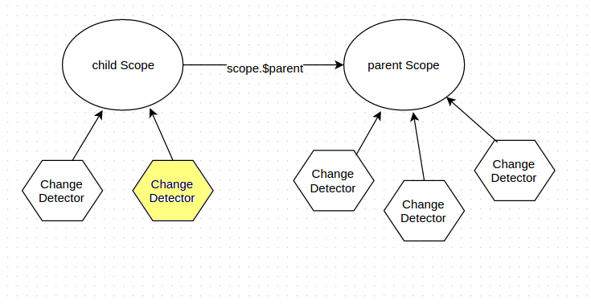

Change Detector
---------------
It lets you observe changes in your scope

ChangeDetector.watch(name, callback, option)
````````````````````````````````````
Set the tracking variable. Also you can track system events, it returns object with method stop()

**Name:**

* **<expression>** - Expression/model
* **<a function>** - Track the result of the function, the function are called every iteration of $scan.
* **"$destroy"** - Track a destroying scope
* **"$any"** - Track a modifying any object
* **"$finishScan"** - a callback is executed as soon as $scan finish work
* **"$finishBinding"** - the callback is called when a binding process finishes, `sample <http://jsfiddle.net/lega911/4H86x/>`_
* **"$finishScanOnce"**
* **"$onScanOnce"** - the callback is called in scan loop

**Option:**

* **option** = true or **option.isArray** = true - watch an array
* **option.readOnly** = true - You can use it if the *callback* doesn't modify the scope. (an optimization option).
* **option.deep** = true - a deep comparison for the object.
* **option.isArray**
* **option.OneTime**
* **option.onStop**

*Optimization tip*: If *callback* returns '$scanNoChanges' then $scan will not run extra-loop (like readonly watch)


ChangeDetector.compile(expression, option)
``````````````````````````````````
Compile an expression

**option**:

* **option.input** - list of input arguments
* **option.no_return** - a function will not return any result (compile a statment)
* **option.string** - result of method will convert to string

.. code-block:: javascript
   :caption: Example of $compile

    var scope = {};
    var cd = alight.ChangeDetector(scope)
    var fn = cd.compile('"hello " + title')
    scope.title = 'linux'
    fn(scope) // return "hello linux"
    scope.title = 'macos'
    fn(scope) // return "hello macos"

.. code-block:: javascript
   :caption: Example with input

    var fn = cd.compile('title + v', { input:['v'] })
    fn(scope, ' X') // return "macos X"

.. code-block:: javascript
    :caption: Example with no_return

    var fn = cd.compile('title = v', { input:['v'], no_return:true })
    fn(scope, 'linux') // scope.title = "linux"


ChangeDetector.eval(expression)
```````````````````````
Execute an expression

ChangeDetector.watchText(tpl, callback)
```````````````````````````````
Track the template

ChangeDetector.new([scope])
```````````````````
Create a child ChangeDetector, if scope is omitted, then it will used parent scope

ChangeDetector.destroy()
````````````````
Destroy the Scope.

ChangeDetector.scan(callback or option)
````````````````````````````````
Starts the search for changes, returns a watch statistic

* **callback** - Method will be called when $scan finishes a work, even if $scan has already started from other a place.

* **option.callback** - see above
* **option.skipWatch** - skip specific watch
* **option.late** = *(true/false)* - If there is a few $scan commands, Angular Light will call only last one.

.. code-block:: javascript
    :caption: Example with $scan

    var scope = {};
    var cd = alight.ChangeDetector(scope);
    cd.watch('title', function(value) {
        console.log('title =', value)
    }); // make observing
    scope.title = 'new'
    cd.scan()
    // print title = new
    scope.title = 'linux'
    cd.scan()
    // print title = linux
    cd.scan()
    // do nothing


ChangeDetector.getValue(name)
`````````````````````
Take the value of the variable, also you can use ChangeDetector.eval

ChangeDetector.setValue(name, value)
````````````````````````````
Set the value of the variable

.. code-block:: javascript
    :caption: Example with $setValue

    var scope = {}
    scope.var = 1;
    scope.path.var = 2;
    scope.path[scope.key] = 3;

    // equal
    var scope = {}
    var cd = alight.ChangeDetector(scope);

    cd.setValue('var', 1);
    cd.setValue('path.var', 2);
    cd.setValue('path[key]', 3);


How does it work?
-----------------

* Scope is a object with user's data which can have a lot of information, it doesn't have own functional, $scope.$watch is a just a link to activeChangeDetector.watch
* ChangeDetector - is a dirty-checking tool which implement "watch", "scan" etc.
* one ChangeDetector instance observes only one object (e.g. scope)
* Different directives makes own ChangeDetectors and observe your data (your scope), so a few (10, 20) change detectors can observe the same scope. e.g. al-repeat observes every item of array, al-if and al-include make own CD for child template with the same scope.

You can't call $watch anytime. When you call scope.$parent.$watch, your parent can have a few CD, and your parent doesn't know which CD should serves your watch-expression. It's why you should take needed CD and call CD.watch

On the other side you can call scope.$watch (inside link function) because in this moment one of the CD is active, so scope.$watch calls activeCD.watch




.. raw:: html
   :file: discus.html
